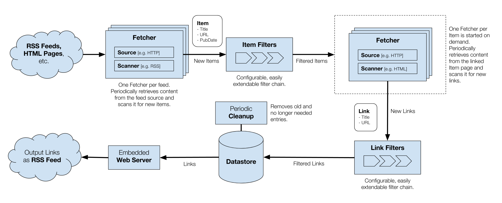

# felix

The **fe**ed **li**nk e**x**tractor.

Felix is a tool for fetching, extracting, filtering and aggregating links from multiple feed sources (RSS feeds, HTML pages, etc.).

## Changelog

See [CHANGELOG](CHANGELOG.md).

For some vague notes about planned features and changes, see also [TODO](TODO.md).

## Installation

### Via go get:

`go get -u github.com/martinplaner/felix`, then run `felix`.

### Via docker:

Automated docker builds are available as [martinplaner/felix](https://hub.docker.com/r/martinplaner/felix/). Pull the image with `docker pull martinplaner/felix`.

The image expects the config file mapped to `/config.yml` and a data volume mounted to `/data`.

## Documentation

Developer documentation can be found on [GoDoc](https://godoc.org/github.com/martinplaner/felix).

User documentation is currently lacking. For the moment have a look at the example config and try to figure it out from there.

## License

Copyright 2017 Martin Planer. All rights reserved.
Use of this source code is governed by a BSD-style
license that can be found in the LICENSE file.
